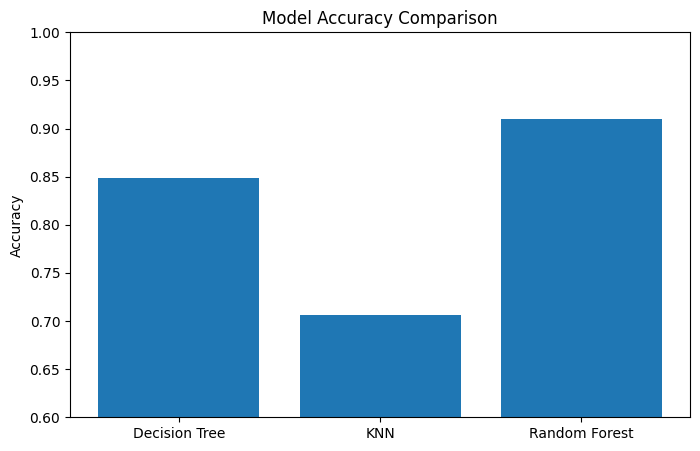
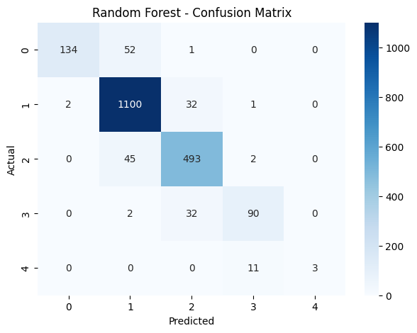
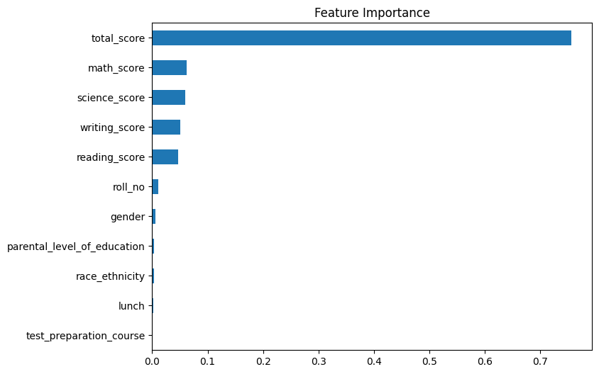
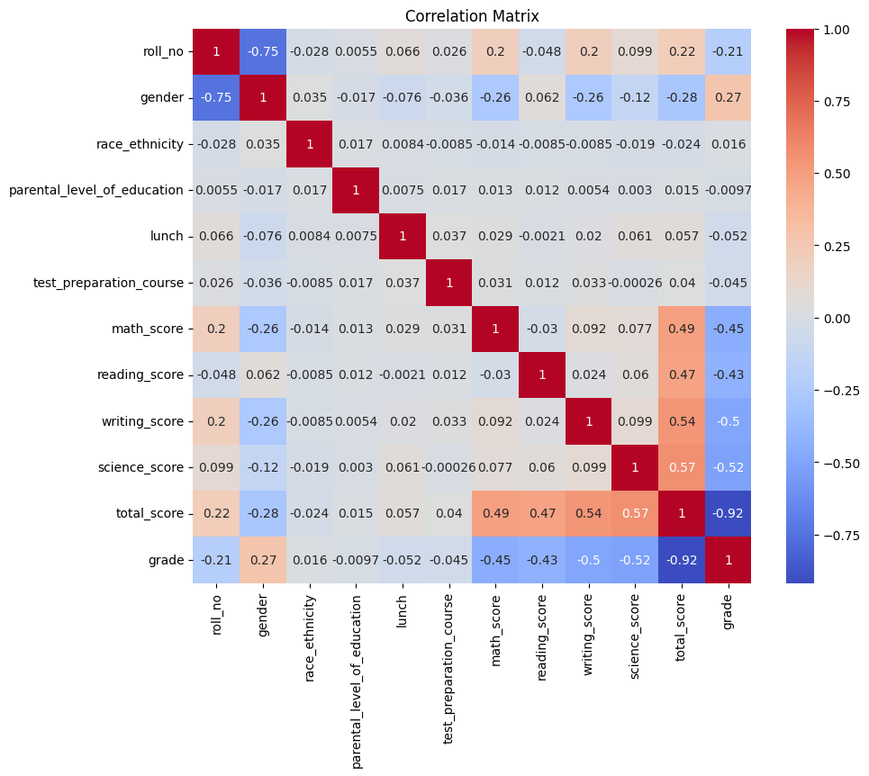

# ai-student-performance-prediction
AI course project for predicting student performance using machine learning

AI Student Performance Prediction

This project aims to predict student academic performance using machine learning techniques. The study analyzes student exam scores and demographic features to classify performance levels.

---

# Project Overview

Understanding student performance is important in education systems. This project uses machine learning models to predict student success based on different features such as exam scores and background information.

---

# Dataset

The dataset contains information about students, including:

- Math score  
- Reading score  
- Writing score  
- Science score  
- Gender  
- Parental level of education  
- Lunch type  
- Test preparation course  

The target variable is **grade**, which represents the student's performance level.

Note: `total_score` was removed from model training to prevent data leakage.

---

# Methods Used

The following machine learning models were applied:

- Decision Tree  
- K-Nearest Neighbors (KNN)  
- Random Forest  

---

# Results

Model performance was evaluated using:

- Accuracy  
- Precision  
- Recall  
- F1-score  

# Best Model:
**Random Forest achieved the highest accuracy (91%)**

---

# Visualizations

### Model Accuracy Comparison

### Confusion Matrix

### Feature Importance

### Correlation Matrix

---

## Key Insights

- Academic scores have the strongest impact on performance  
- Demographic features have limited influence  
- Random Forest performs better due to ensemble learning  
- Class imbalance affects smaller classes  

---

---

## How to Run

1. Clone the repository: git clone https://github.com/merunaq/ai-student-performance-prediction.git

2. Open the notebook: analysis.ipynb

3. Run all cells

---

## Conclusion

Random Forest is the most effective model for this problem. Machine learning can be successfully used to predict student performance and support decision-making in education.

---

## Author

Merve Karataş  
AI Course Project – 2026
